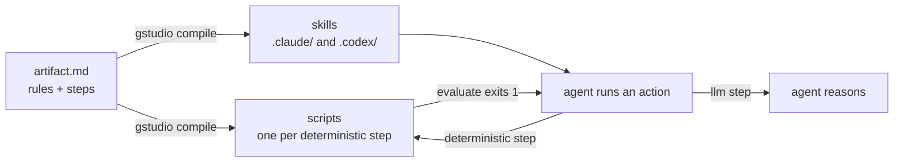

# gstudio

Compiles a codebase's conventions into skills that Claude Code and Codex follow, and scripts that check them.



Every codebase has rules that live only in people's heads: where a kind of file goes, what it must look
like, what to clean up when one is removed. Coding agents break them because they cannot know them.

The usual fix is a `CLAUDE.md` or `AGENTS.md` full of prose. Nothing checks
whether the agent followed it. A linter checks, but only what fits in a lint rule, and it tells the agent nothing about how
to create or delete a file correctly. Hand-written skills get closer, but they are written once per agent,
drift from the rules they restate, and leave the agent reasoning through steps a script could settle:
creating a file from a template, finding every reference to a name.

gstudio writes a convention as one document holding the rules and the moves, each move split into what a
script can decide and what needs judgement. This is the `class` artifact this repository follows, shortened:

```markdown
ID: name

1. ALL Classes are defined at src/classes/{name (PascalCase)}.class.ts
2. The file must ONLY have one top level definition ...

## create

<llm>Input: class name and optionally the content of the class</llm>
<deterministic>
    Scaffolds the class file as defined at the rules, exits 1 if the file already exists.
</deterministic>

## evaluate

<llm>Input: class name</llm>
<deterministic>
    Evaluate that:

    1. The file has ONLY have one top level definition and must be a named export of a class. ...

    If it complies with all the rules, exits 0.
    Otherwise, iterate over each discrepancy, print them to stdout and exit with 1.
</deterministic>
<llm>
    Ensure that the functions defined in the class are only from the scope of the class ...
</llm>
```

```bash
gstudio compile artifact class
```

## How it works

An artifact opens with its rules, followed by sections for a fixed set of verbs: create, list, update,
delete and evaluate. Compiling asks the `claude` CLI to write a script for each deterministic step.
Each action becomes a skill, written to both `.claude/skills` and `.codex/skills`, that carries the rules
and tells the agent which steps to run as scripts and which to reason through. Create and update end in a
loop: run the evaluate steps, fix what they report, repeat until every script exits 0.

Every step is keyed by a hash of its inputs, so recompiling rebuilds only what changed. The same format
describes features installable into other projects; gstudio hashes every file a feature writes, so removing
or updating it leaves your edits alone.

## What it does not do

gstudio does not run skills. Claude Code or Codex does, and the llm steps are only as reliable as the agent
following them. The scripts are generated by a model; read them before you commit them. Editing an
artifact's rules rebuilds all of its scripts, one model call each.

If your conventions fit in a few paragraphs, a `CLAUDE.md` is enough. If they are entirely mechanical, a
linter or a code generator does the job without a model in the loop. gstudio is for the rules in between.
